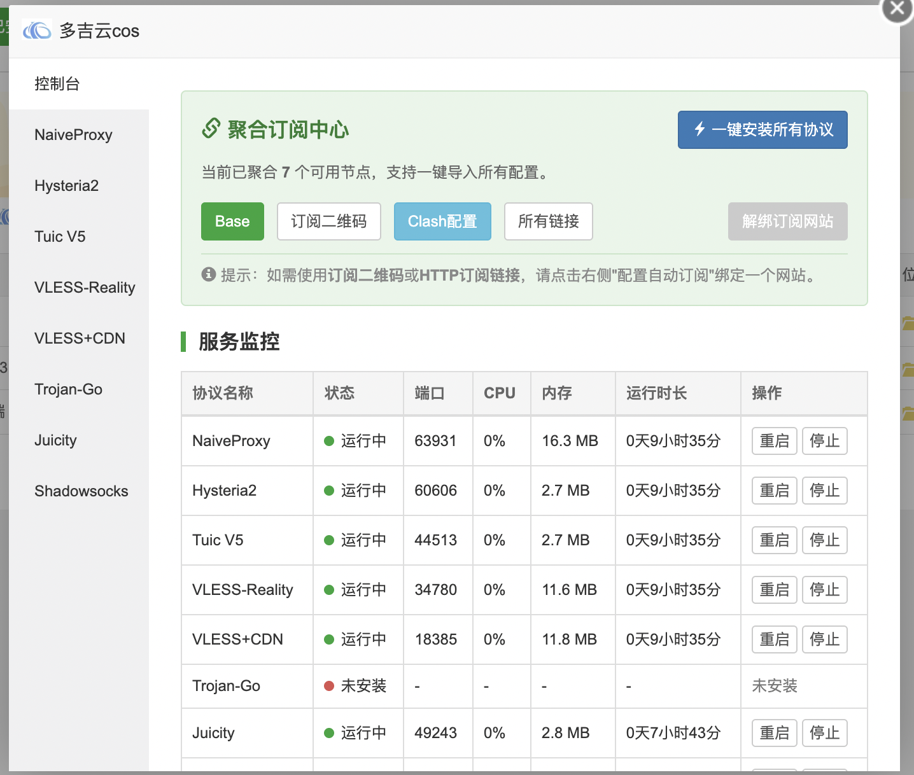
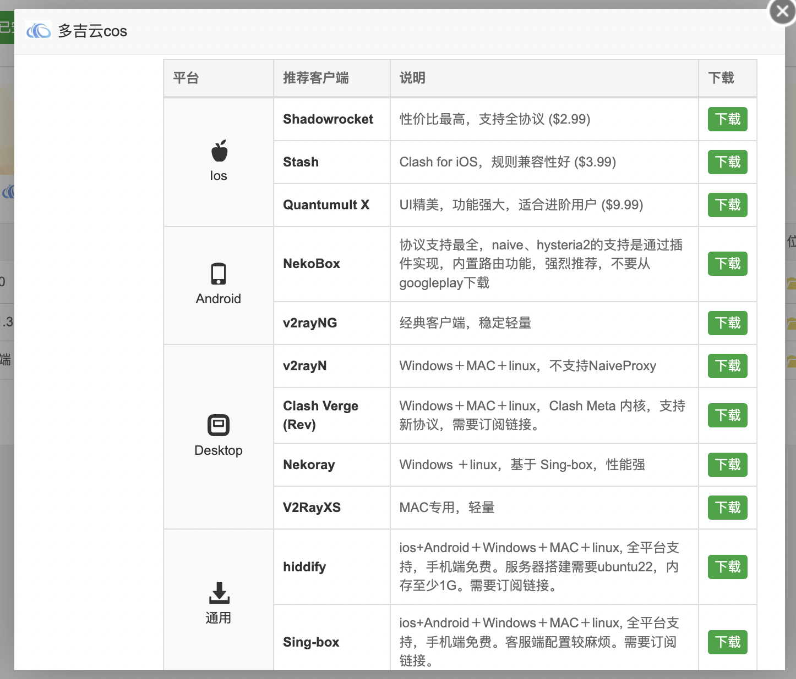
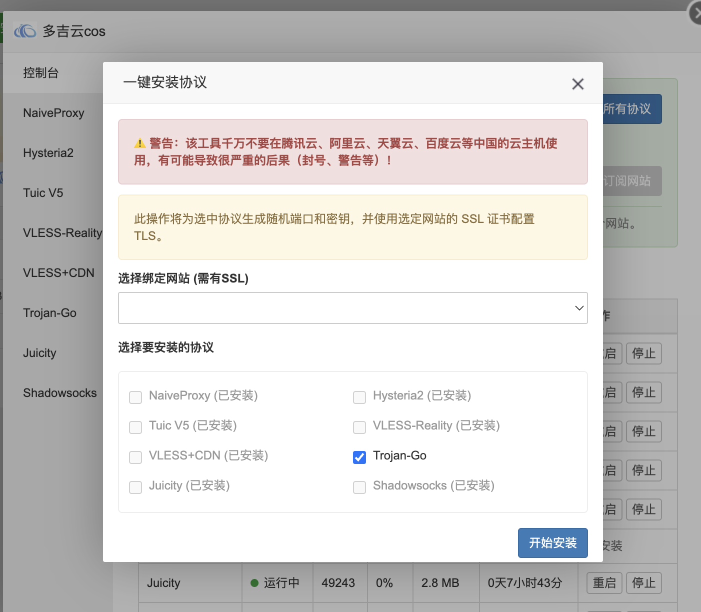
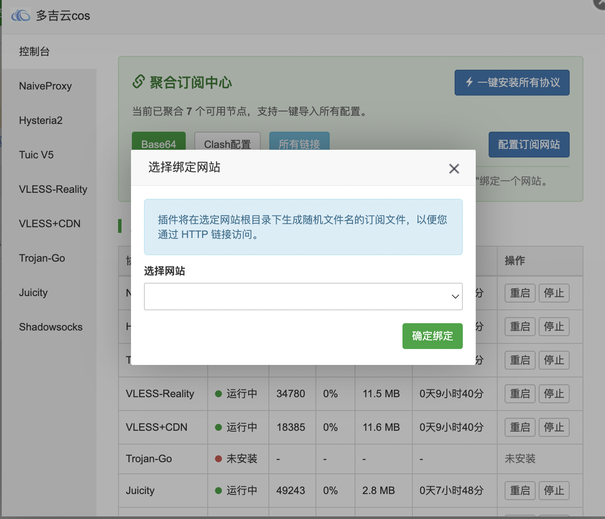
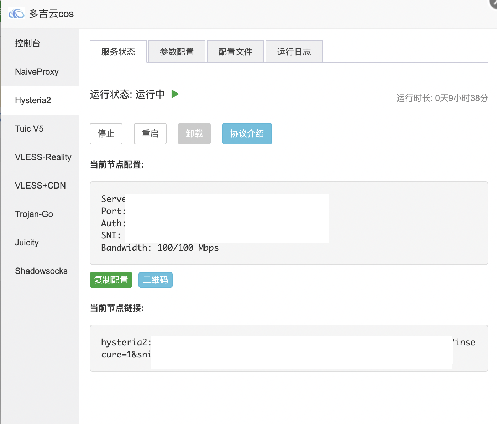
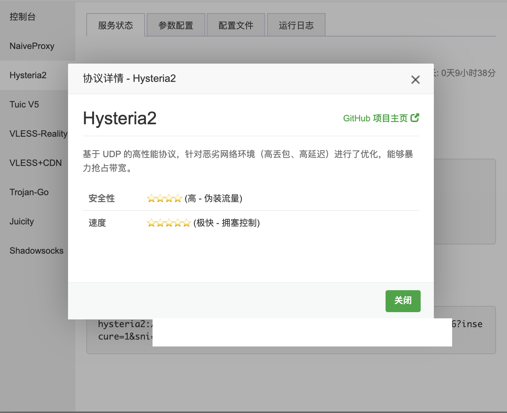
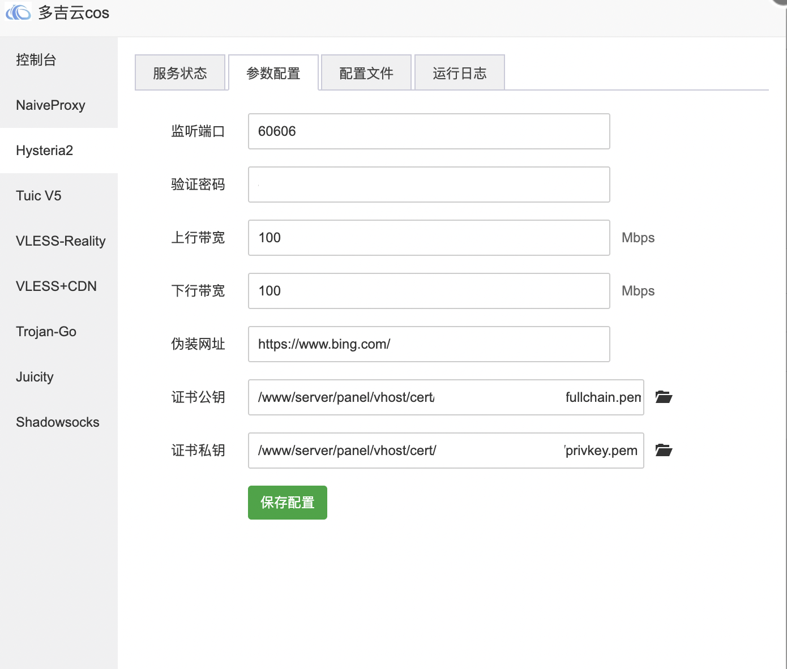
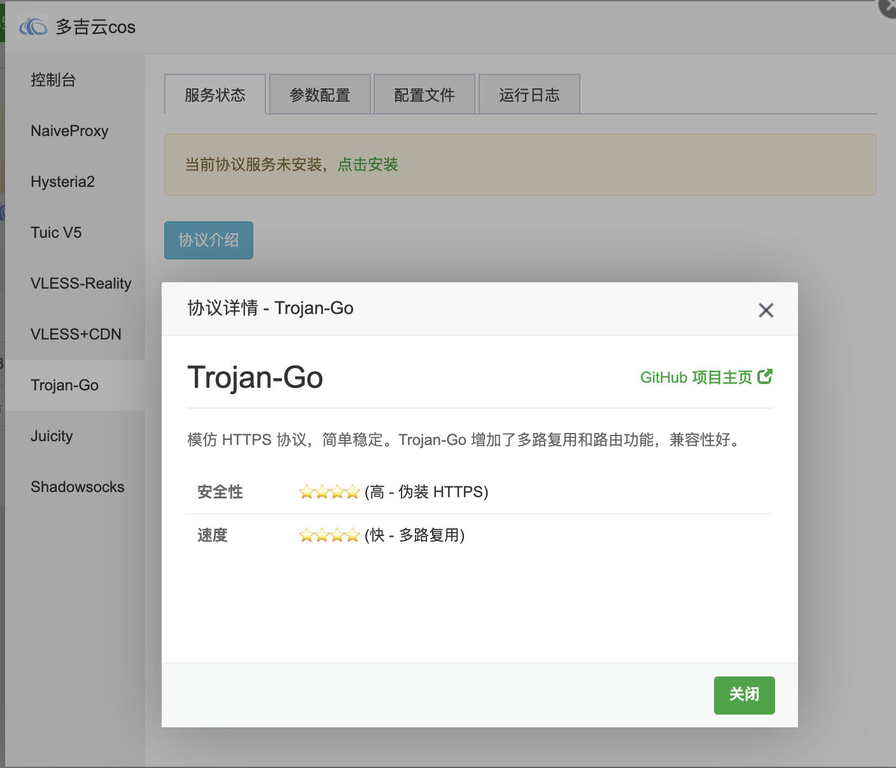
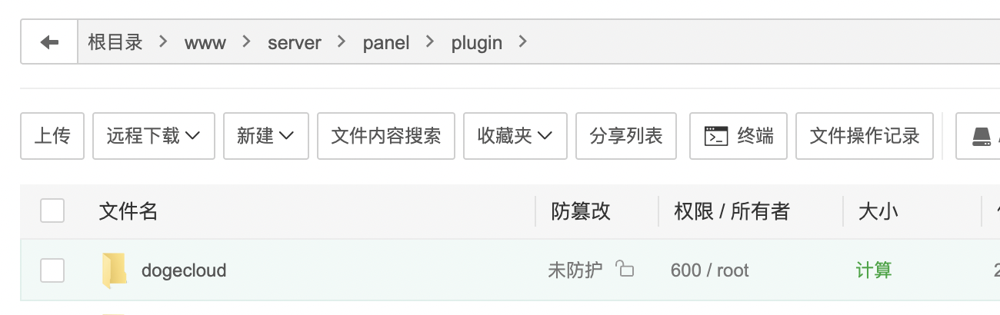

这是一个为宝塔面板（BT Panel）设计的网络协议管理插件，简化高性能传输协议的部署与维护。

# 宝塔面板多协议管理插件 

本项目是一个基于宝塔面板开发的科学上网功能插件，集成了目前主流的高性能网络传输协议。通过可视化的操作界面，用户可以轻松完成服务的安装、配置、监控及客户端连接信息的生成。由于宝塔面板最近改进了软件机制，只能基于已有的插件进行改造使用，所以使用DogeCloud插件改造。

界面预览：

























## 🚀 功能特性

*   **多协议支持**：集成多种前沿传输协议，满足不同网络环境下的需求：
    *   **NaiveProxy**: 基于 Chrome 网络栈，抗探测能力强。
    *   **Hysteria2**: 基于 UDP 的高性能协议，优化弱网环境传输。
    *   **Tuic V5**: 基于 QUIC 协议，低延迟高吞吐。
    *   **Xray (VLESS-Reality)**: 新一代轻量化协议，无需域名即可使用。
    *   **Xray (VLESS+CDN)**: 经典的 WebSocket + TLS 模式，支持 CDN 中转。
    *   **Trojan-Go**: 兼容性好，支持多路复用。
    *   **Juicity**: 基于 QUIC 的新兴协议，拥塞控制优秀。
    *   **Shadowsocks**: 基于 Rust 版的高性能实现 (2022标准)。
*   **一键部署**：自动化安装脚本，自动处理依赖、服务配置及防火墙放行。
*   **可视化配置**：提供直观的表单界面修改端口、密钥、证书路径等参数，支持在线编辑配置文件。
*   **订阅管理**：
    *   自动生成通用订阅链接（Base64）。
    *   支持生成 Clash 配置文件。
    *   支持绑定网站目录，生成 HTTP 订阅链接。
    *   提供二维码快速扫码连接。
*   **状态监控**：实时监控服务运行状态、CPU 及内存占用。

## 🛠 安装说明

本插件未上架宝塔软件商店，需要手动安装。

### 1. 上传至服务器
将 `dogecloud` 下载并解压到宝塔面板的插件目录下：

**目标路径**：

```bash
/www/server/panel/plugin/dogecloud
```




确保目录结构如下：

```text
/www/server/panel/plugin/dogecloud/
├── dogecloud_main.py
├── index.html
├── info.json
├── icon.png
├── ...
```

### 2. 启用插件
1. 登录宝塔面板。

2. 进入 **软件商店** -> **已安装**（或查找dogecloud）。

3. 找到 **宝塔科学上网 (DogeCloud)** 插件，点击设置即可开始使用。

   

4. 注意，千万不要点“更新”，升级之后则是另外一个插件。在此对DogeCloud的原作者说声抱歉。

5. 在使用之前，宝塔面板需要完成安装nginx、并有一个可用的网站，并有一个域名和证书。（域名、证书这些都在后续会使用）

## 📖 使用指南

1.  **服务安装**：插件主界面“控制台”首页，可以使用一键安装，安装所需的协议。在插件主界面选择需要的协议标签页（如 Hysteria2），点击“点击安装”。插件会自动下载核心文件并注册 Systemd 服务。
2.  **参数配置**：安装完成后，在“参数配置”选项卡中修改端口、密码、证书路径等信息，点击保存并重启服务。
3.  **获取连接信息**：
    *   **单节点**：在“服务状态”页可以看到当前节点的分享链接和二维码。
    *   **聚合订阅**：在“控制台”首页，可以获取包含所有已安装服务的聚合订阅链接或 Clash 配置。
4.  **证书说明**：对于需要 TLS 的协议（如 Naive, Hy2, Tuic, Trojan 等），建议先在宝塔“网站”管理中添加一个站点并申请 SSL 证书，然后在插件配置中指向该站点的证书文件（通常位于 `/www/server/panel/vhost/cert/域名/`）。


## ⚠️ 免责声明

*   本项目仅供技术学习与网络协议研究使用。
*   请勿在阿里云、腾讯云等官方云服务主机使用。
*   使用本项目产生的任何后果由用户自行承担。